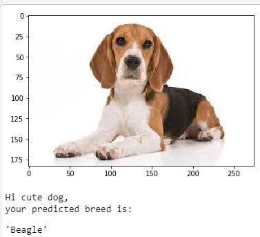
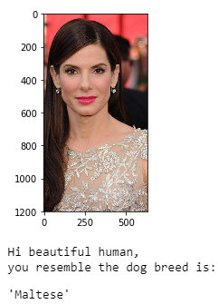
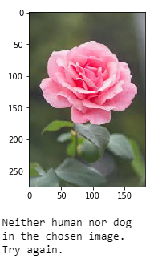

# Dog Breeds Classifier

## Table of Contents

1. [Project Motivation](#motivation)
2. [File Descriptions](#files)
3. [Results](#results)
4. [Required Libraries](#libraries)
5. [Acknowledgements](#acknowledgements)

## Project Motivation 

The project goal is to classify images of dogs according to their breed.
For this purpose, I built an image classification model with convolutional neural networks.
The model could be used as part of a mobile or web app. 
The model accepts any user-supplied image as input. 
If a dog is detected in the image, it will provide an estimate of the dog's breed. 
If a human is detected, it will provide an estimate of the dog breed that is most resembling. 
The image below displays potential sample output of your finished project.

## File Descriptions 
- dog_app.ipynb is a Jupyter notebook, contains the whole project code to create a dog breed classifier.
- The images folder includes all images used for this project.
- The saved_models folder contains the models saved during this project

## Results 
I applied the model on 6 samples, 2 dogs, 2 human, and 2 others. 
The model was able to determine whether the image contains a human, dog, or neither. 
- It predicted the correct dog breed for both dogs.

- When I entered Sandra Bullock face, it resembled her with Maltese dog breed.

- When I entered a flower image, it didn’t recognize it as a dog or a human.

The technical details of the project can be found on the this blog post  
[Write an Algorithm for a Dog Identification App](https://medium.com/@manar.alharbi.94/write-an-algorithm-for-a-dog-identification-app-cc453d2c63b1)

## Required Libraries 

- Pandas, NumPy, Scikit-learn (Machine Learning Libraries)
- Matplotlib (Python 2D plotting library)
- Keras (Neural-network library)
- Glob library 

## Acknowledgements 

The below links, were very useful for completing the projects,
- https://keras.io/layers/convolutional/
- https://computersciencewiki.org/index.php/Max-pooling_/_Pooling
- https://alexisbcook.github.io/2017/global-average-pooling-layers-for-object-localization/
- https://dataaspirant.com/2017/03/07/difference-between-softmax-function-and-sigmoid-function/
- https://towardsdatascience.com/whats-the-difference-between-haar-feature-classifiers-and-convolutional-neural-networks-ce6828343aeb
